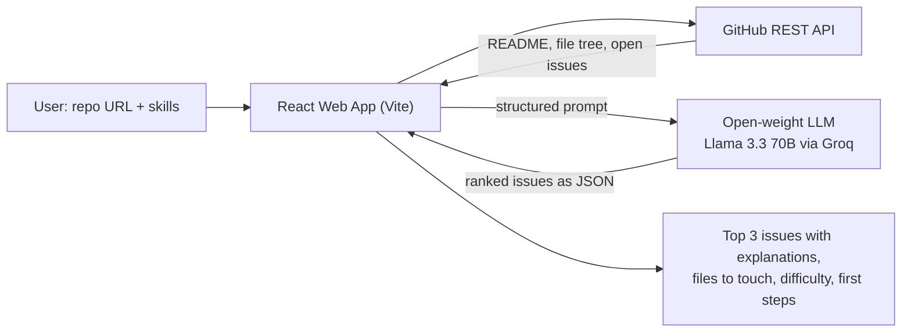

# First-PR Finder

**Find your perfect first open-source contribution — powered by an open-weight AI model.**

Built at **Hacktoberfest Hack Day · Hyderabad** (MLH × DEV × React Hyderabad) for the **Best Open-Source AI Project** challenge.

---

## The Problem

New contributors open a GitHub repo, see 200 issues, and give up. The "good first issue" labels are often missing, outdated, or still too vague for a beginner to know where to start.

## The Solution

Paste any public GitHub repo link and tell First-PR Finder what you know (e.g., *"Python, beginner"*). An open-weight LLM reads the repo's README, file structure, and open issues, then recommends the **3 best issues for you**.

For each issue it gives you:
- **Plain-English explanation** of what the issue is actually asking
- **Files you'll likely need to touch**, picked from the real repo tree
- **Difficulty rating** (Easy / Medium / Hard) based on your skill level
- **First steps** to get started on the fix

## Why the AI is Central

Without the model there is no product. The AI does the core work. It **reads and understands** messy issue text, **matches** issues to the user's skills, and **maps** each issue to relevant files in the codebase. The GitHub API only supplies raw data; every recommendation comes from the model.

## Architecture



## Open-Weight Model

| Property | Details |
|---|---|
| **Model** | Llama 3.3 70B (`llama-3.3-70b-versatile`) |
| **Weights** | Open-weight, released by Meta under the Llama 3.3 Community License |
| **Inference** | Groq API (fast hosted inference, no GPU needed locally) |

The model is swappable. Set the `GROQ_MODEL` environment variable to use any other open-weight model Groq hosts (e.g. Qwen or GPT-OSS).

## Tech Stack

- **React** + **Vite** for the UI
- **GitHub REST API** for repository data
- **Groq SDK** for open-weight LLM inference (Llama 3.3 70B)
- **Vanilla CSS** with sleek modern dark mode & glassmorphism

## Run It Locally

```bash
git clone https://github.com/itsamar971/rthyd-opsc.git
cd rthyd-opsc
npm install
```

Set your API key in a `.env` file (or enter it directly in the app UI):

```bash
GROQ_API_KEY="your_groq_key"
# Optional: add a GitHub token to avoid rate limits on shared Wi-Fi
GITHUB_TOKEN="your_github_token"
```

Start the app:

```bash
npm run dev
```

## Example

- **Input:** `https://github.com/reacthyderabad/hacktoberfest-hack-day-2026` · *"JavaScript, beginner"*
- **Output:** 3 recommended issues, each with an explanation, the likely files, a difficulty rating, and first steps.

## Future Ideas

- Package the recommender as an **Agent Skill** (Agent Skill Open Standard) so coding agents can use it
- Support for fully local inference via Ollama
- Telugu and Hindi explanations for regional contributors
- Auto-generate a draft PR description

## Team

- Your Name — [@your-github](https://github.com/your-github)

## License

This project is licensed under the [MIT License](LICENSE).
